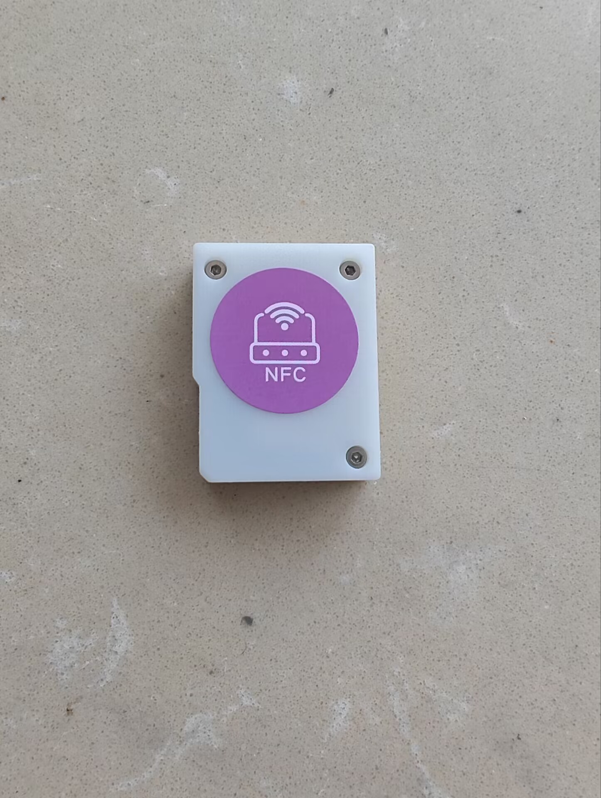
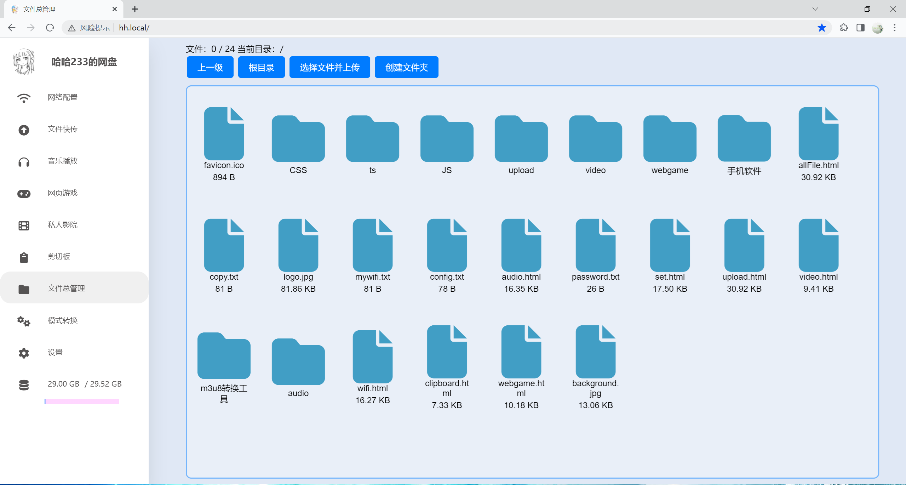
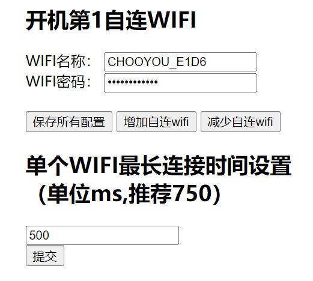
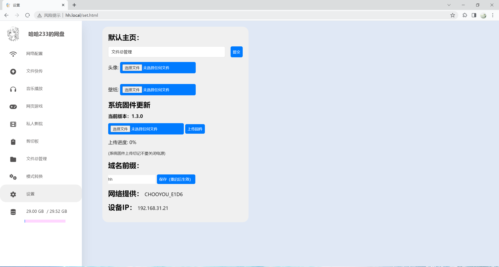

# ESP32-SDcard-WebServer
项目名称：ESP32便携SD卡服务器

作者：B站 哈哈233jpg

项目实现文件管理、开机自连WIFI、设置（含OTA,域名前缀修改）、网页flash游戏和html游戏、播放视频、模式转换（AP STA AP+STA互相转换）、剪切板功能

成品尺寸:4\*3(3.1)\*1.18cm。

# 相关链接：

哔哩哔哩视频：https://www.bilibili.com/video/BV1Pw4m1X751/?share_source=copy_web&vd_source=56efb7e45102ec59491d4ff5ddfdc196

立创开源广场：https://oshwhub.com/haha233.jpg/backupprojects_haha233-jpg_personal_0_20240427

gitee项目地址（自动同步github）：https://gitee.com/haha233jpg/esp32-sdcard

# 个人博客：

https://hehao666.github.io/

# 功能

1、文件批量上传、下载、重命名、删除、在线修改.html和.txt文件

2、开机自连WIFI

  

3、设置（含OTA,域名前缀修改）

4、网页视频

浏览器播放内存卡m3u8视频

5、剪切板

文本中转，快捷共享

6、网页flash游戏和html游戏

浏览器在线游玩网页flash游戏和html游戏

7、WiFi配网（模式转换）

开机进入STA模式，第一次点击切换为AP模式，AP模式下点击进入网页配网页面（AP+STA模式），该页面可以修改AP模式热点的名称、密码。
