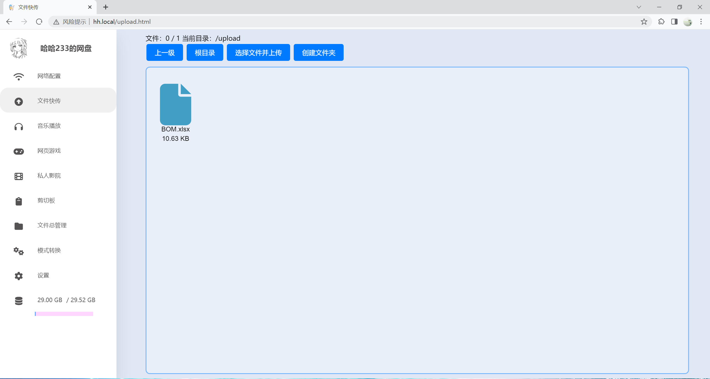

# ESP32-SDcard-WebServer
项目名称：ESP32便携SD卡服务器

作者：B站 哈哈233jpg

项目实现文件管理、开机自连WIFI、设置（含OTA,域名前缀修改）、网页flash游戏和html游戏、播放视频、模式转换（AP STA AP+STA互相转换）、剪切板功能

成品尺寸:4\*3(3.1)\*1.18cm。

# 相关链接：

哔哩哔哩视频：https://www.bilibili.com/video/BV1Pw4m1X751/?share_source=copy_web&vd_source=56efb7e45102ec59491d4ff5ddfdc196

哔哩哔哩视频（进阶介绍）：https://www.bilibili.com/video/BV1Aw4m1X7CM/?share_source=copy_web&vd_source=56efb7e45102ec59491d4ff5ddfdc196

哔哩哔哩视频（1.3.0版本）：https://www.bilibili.com/video/BV1Vi421S7QR/?share_source=copy_web&vd_source=56efb7e45102ec59491d4ff5ddfdc196

立创开源广场：https://oshwhub.com/haha233.jpg/backupprojects_haha233-jpg_personal_0_20240427

gitee项目地址（自动同步github）：https://gitee.com/haha233jpg/esp32-sdcard

# 个人博客：

https://hehao666.github.io/

# 功能

1、文件总管理

2、文件快传

3、网络配置

4、设置

5、私人影院

6、剪切板

7、网页游戏

8、音乐播放

